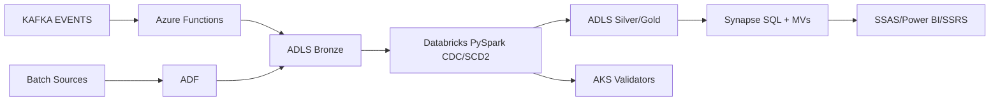

# Azure Data Engineering — Near‑Real‑Time Insurance Analytics (Medium)

Move executive reporting from day‑old to near‑real‑time using Azure‑native ingestion, Databricks transforms, and Synapse serving with automated quality gates.

## Architecture
- **Ingest:** Kafka → Azure Functions (micro‑batch), plus ADF for batch → ADLS Gen2 (Bronze)
- **Transform:** Databricks (PySpark) for CDC MERGE + SCD2 → ADLS (Silver/Gold)
- **Serve:** Synapse SQL (materialized views) → SSAS/Power BI/SSRS
- **Quality:** Databricks validation + containerized Python validators on AKS

## Key Results
- 500K+ records/day ingested, **40–50% faster** processing
- **80%** less manual prep; **~40%** lower query latency

## Getting Started
1. Provision ADLS/Synapse/Databricks/AKS.
2. Update `infra/adf/pipeline.json` linked services.
3. Deploy Functions + Databricks jobs via `scripts/deploy_ci_cd.md`.
4. Create materialized views from `infra/synapse/materialized_views.sql`.
5. Run validators in AKS (`aks/validator`).

## Tech
ADF, Functions, ADLS Gen2, Databricks (PySpark), Kafka, AKS, Synapse SQL, SSAS/SSRS/Power BI, Jenkins/Azure DevOps.
